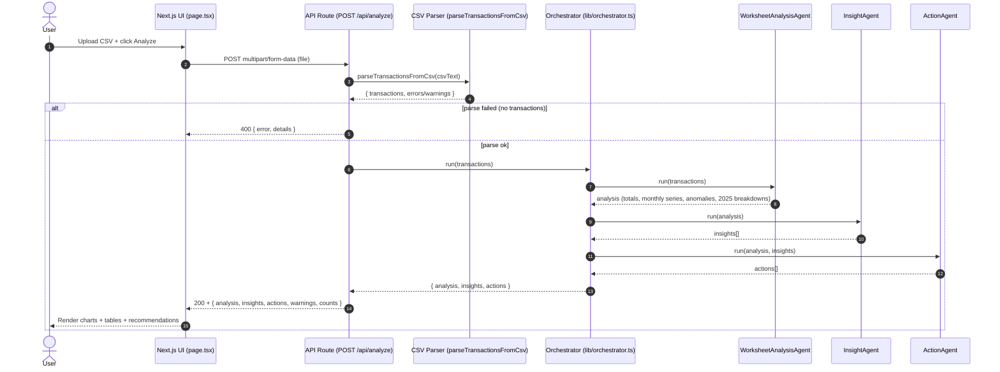

# Agent Orchestration Sequence Diagram

This document describes how the agents in the `agenticai` project are orchestrated.

## Sequence diagram

## Where this maps in code

- Orchestration:
  - `src/lib/orchestrator.ts`

- Agents:
  - `src/lib/agents/worksheetAnalysisAgent.ts`
  - `src/lib/agents/insightAgent.ts`
  - `src/lib/agents/actionAgent.ts`

- Entry point:
  - `src/app/api/analyze/route.ts` (API)
  - `src/app/page.tsx` (UI)
